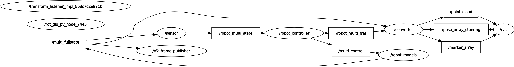
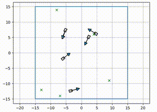
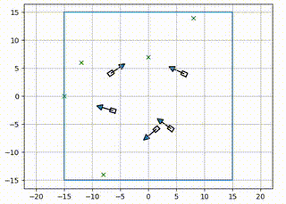

# Collision Avoidance for Bumper Cars

## Overview

This repository contains the code and documentation for my master's thesis project titled "Collision Avoidance for Bumper Cars." The project focuses on simulating N bumper cars traveling around a squared arena, with the primary goal of implementing and comparing different collision avoidance methods.

## Table of Contents

- [Overview](#overview)
- [Features](#features)
- [Project Structure](#project-structure)
- [Dependencies](#dependencies)
- [Installation](#installation)
- [Usage](#usage)
- [Collision Avoidance Methods](#collision-avoidance-methods)
- [ROS2 and Rviz2 Integration](#ros2-and-rviz2-integration)
- [License](#license)
- [Acknowledgements](#acknowledgements)

## Features

- Simulation of N bumper cars in a squared arena.
- Implementation and comparison of different collision avoidance methods.
- Models: Kinematic and Dynamic Bicycle Model.
- Collision Avoidance Methods: Circular Control Barrier Function, Collision Cone Control Barrier Function, Dynamic Window Approach.
- ROS2 integration for simulation and communication.
- Live visualization in Rviz2.

## Project Structure

The most important forlder is the /src one, where all the developement code is stored. Indide this directory there are all the packages created to make the simulation work:

- Bumper_cars: This package contain all the building blocks for the ROS architecture. It contains the following nodes:
  - broadcaster.py: this nodes publishes the frame (system of coordinates) for each robot with respect with the fixed world frame. This node will be especially important further down the road when the simualtion will be more complex.   
  - car_model.py: node responsible for applying the control input to the model and spitting out the updated bumper cars states.
  - controller.py: applies the different control methods to the current state basing on the target that each bumper cars has and spits out the control input.
  - converter.py: this node acts as a bridge between my simulation and the ros visualization tool RViz. Basically Rviz needs ros_standard_msgs to work, and the nodes of my simulation use custom messages that I created just for this application. Therefore this nodes takes all the custom messages and converts them into ros_standard_msgs.
  - plotter.py: this was used in earlier versions of the code instead of the RViz tool, but was abandoned due to long computational time. It's still a useful tool because it is more flexible, and it's easier to custom the visualization with respect to RViz.
  - sensor.py: this node simulates the sensor that measures the positions of the cars and sends the current states to the controller. In the future, the plan is to also add noise corruption to the measurement to make the simulation more realistic.
- custom_message: this package contains all the user defined custom messages. This are not ros_standard_msgs but they were useful becuase, for example, I haven't found any standard message to send the combine control input $[a,\delta]$.
- planner: this package contains all the modules responsible for the control algorithm and collision avoidance algorithms.
- sym_bringup: this package contains the launch file to launch the ROS simulation.

All the nodes and the excanged topics are visible in the following figure:

## Dependencies
I'm running this project on ROS2 humble, using UBUNTU 22.04. 
ROS dependencies:
- rclpy
- geometry_msgs
- sensor_msgs
- visualization_msgs
- message_filters
- tf2_ros

Python dependecies
- matplotlib
- numpy
- cvxopt
- scipy
- pathlib
- shapely
- json

## Installation

1. Follow the instruction to install ROS2 humble provided on this website: [ROS2 Documentation: Humble](https://docs.ros.org/en/humble/Installation/Ubuntu-Install-Debians.html)
2. Clone the repository: `git clone https://github.com/buranig/Master_thesis.git` inside a development folder, i.e. /dev_ws
3. Install dependencies: `pip install -r requirements.txt` --> TODO
4. Build the packages using: `colcon build --symlink-install`
5. Modify the source file to source with shortcut --> TODO (see how it's done)
6. Source the folder using: `source ~/.bashrc`
7. Each time one opens a new terminal to run packages from this repo, source the terminal using: `source .bashrc`

## Usage

A crucial file is the `/home/giacomo/thesis_ws/src/bumper_cars/params.json` file, which contains al the simulation parameters such as maximal speed and dimensions of the bumper cars, but also the numbero of robot to simulate, the controller type and the arena dimensions. In other words all the tuning parameters are in this file. At the moment of writing there are a couple of controller types:
- controller_type:
  - random_goal: this method samples point inside the arena and uses them as targets for the robots. It works with Control Barrier Functions as collision avoidance methods.
  - rangom_harem: this method chooses random robots to follow for a certain amount of time. It works with Control Barrier Functions as collision avoidance methods. It still need some work.
  - random_walk: this method applies each iteration a random acceleration and a random steering angle and uses Control Barrier Functions a collision avoidance method.
  - DWA: this method samples point inside the arena and uses them as targets for the robots. It works with Control Barrier Functions as collision avoidance methods.
- cbf_type: the possible values are "CBF_simple" or "C3BF".

To run the ROS simulation, one needs to open two terminals and run:

- `ros2 launch sym_bringup demo.launch.py`
- `ros2 launch sym_bringup robot_model.launch.py`
  
To run the single collision avoidance files, one can simply open the files in the preferred IDE and run them.

## Collision Avoidance Methods

### Control Barrier Functions (CBF)

$$ u_i^{\ast}(x,t) = \min_{u \in U} \| u_i - u_{ref}(x,t)\| ^2 $$

$$ \textrm{s.t. } L_f h_{i,j}(x) + L_g h_{i,j}(x)\cdot u_i + \kappa(h_{i,j}(x))\geq 0 $$

$$ i,j \in \{1, 2, \dots , N\} \textrm{ , } i\neq j $$
      

### Circulare Control Barrier Function (CBF)
$$ h_{i,j}(x) = \| x_i -x_j\| ^2 - (r^2 + K_v \cdot v_i) $$

### Collision Cone Control Barrier Function (3CBF)

$$h_{i,j}(x) = \langle p_{rel} , v_{rel}\rangle + \|p_{rel}\| \|v_{rel}\| \cos(\phi)$$

$$p_{rel} = \begin{bmatrix} x_i - x_j \\
                            y_i - y_j 
            \end{bmatrix}$$

$$v_{rel} = \begin{bmatrix}
                v_i\cdot \cos(\theta_i) - v_j\cdot \cos(\theta_j)\\
                v_i\cdot \sin(\theta_i) - v_j\cdot \sin(\theta_j)
            \end{bmatrix}$$

$$\cos(\phi) = \frac{\sqrt{\|p_{rel}\|^2 - R^2}}{\|p_{rel}\|}$$

### Dynamic Window Approach

## ROS2 and Rviz2 Integration

Explain how ROS2 and Rviz2 are integrated into the project. Include details on communication between nodes, topics used, and how to visualize the simulation in Rviz2.

## License

Specify the license under which your project is distributed. If applicable, include licensing information for third-party libraries.

## Acknowledgements

Acknowledge any individuals, organizations, or resources that contributed to your project.
